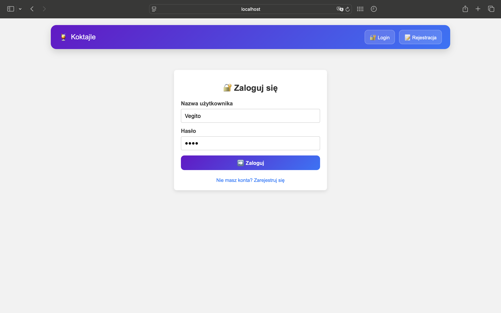
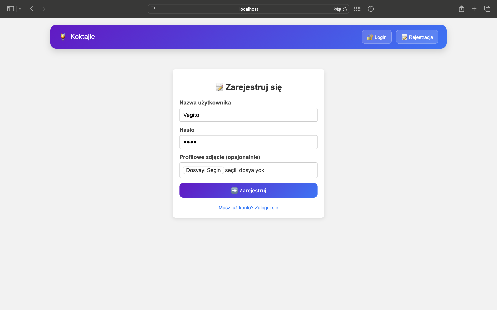
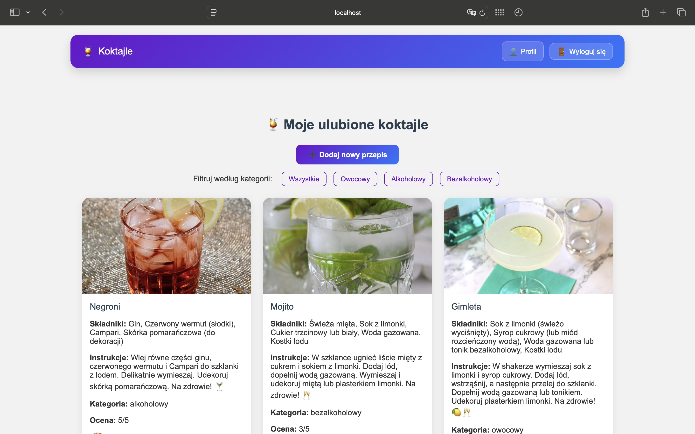
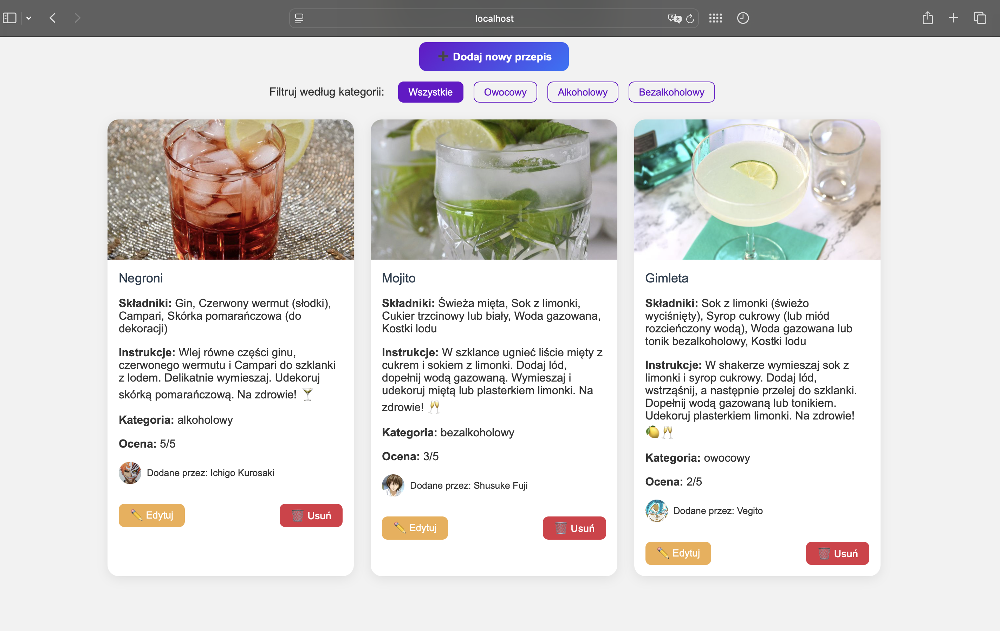
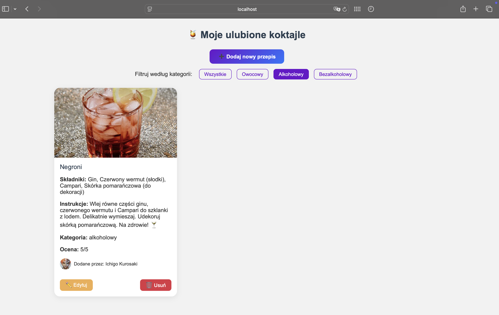
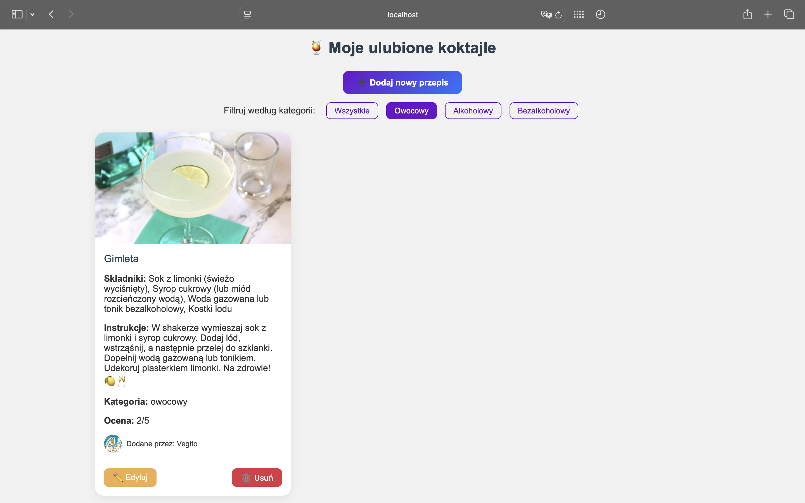
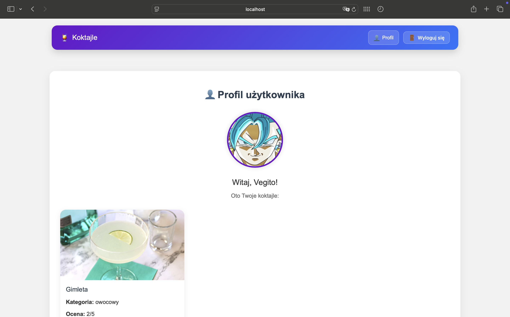

###  Kolekcja ulubionych przepisów do koktajli

#  Opis projektu

Aplikacja „Kolekcja ulubionych przepisów do koktajli” została stworzona jako projekt zaliczeniowy z przedmiotu dotyczącego tworzenia aplikacji internetowych z wykorzystaniem Node.js oraz wzorca architektonicznego MVC. Umożliwia użytkownikom tworzenie i przeglądanie przepisów na koktajle oraz zarządzanie swoim profilem.

## ✅ Funkcjonalności

- Rejestracja użytkownika z możliwością dodania awatara
- Logowanie i wylogowywanie
- Dodawanie przepisów koktajlowych (tytuł, opis, składniki, zdjęcie)
- Edytowanie i usuwanie własnych przepisów
- Przeglądanie wszystkich przepisów w galerii
- Strona profilu z listą przepisów danego użytkownika
- Estetyczny interfejs (własne stylowanie CSS)
- Obsługa sesji i autoryzacji

## 🖼️ Zrzuty ekranu

### 🔐 Logowanie

### 📝 Rejestracja

###  HomePage

### 🍹 Koktejle

### 🍹 Koktejle alkoholowy

### 🍹 Koktejle bezalkoholowy

### 🍹 Koktejle owocowy

### 👤 Profil użytkownika

